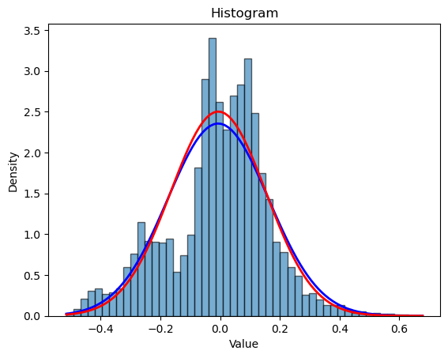

<picture align="center">
  <source media="(prefers-color-scheme: dark)" srcset="images/logo.png">
  
</picture>

-----------------

# sdatools: Statistics & Data Analysis Tools

**Author:** Mike Fuller

**Last Updated:** 10th August 2025

This repository contains the source code for `sdatools`, a **work-in-progress** Python package I am developing to kill two birds with one stone: build my very first Python package whilst refreshing my knowledge of various statistics and data analysis techniques. I am taking a bottom-up approach as much as possible: whilst the package occasionally leverages well-known scientific packages like `numpy`, `pandas`, `scipy` and `matplotlib`, I aim to build most modules from scratch.

I am regularly producing unit tests in the [`tests`](https://github.com/itsmikefuller/sdatools/tree/main/tests) directory to check that the package's components are behaving as expected. 

## Contents

- [Key Features](#key-features)
- [Case Studies](#case-studies)
- [Ongoing Development](#ongoing-development)

## Key Features

### [`sdatools.core`](https://github.com/itsmikefuller/sdatools/tree/main/src/sdatools/core)

Contains fundamental utilities and mathematical functions used throughout the `sdatools` package.

The `functions` sub-module implements Normal distribution functions $\phi(x)$, $\Phi(x)$ and the error function `erf(x)`. 

The `utils` sub-module presents a decorator, `vectorise_input`, which allows scalar functions to be extended to array-like objects and computed element-wise. Such array-like objects are defined as `ArrayLike` (or `SeriesLike` for 1D array-like objects) in the `types` sub-module. 

### [`sdatools.data_visualisation`](https://github.com/itsmikefuller/sdatools/tree/main/src/sdatools/data_visualisation)

Contains a suite of data visualisation classes that build on classic statistical visualisations from `matplotlib.pyplot`. For example, the `Histogram` class implements the method `overlay_pdf()`, allowing the user to overlay a PDF of any given distribution class from `sdatools.distributions`.

Q-Q plots and histograms are currently supported.

### [`sdatools.distributions`](https://github.com/itsmikefuller/sdatools/tree/main/src/sdatools/distributions)

Contains a suite of continuous and discrete distributions. Discrete distributions currently supported are:
- Binomial - $\text{Bin}(n, p)$
- Poisson - $\text{Po}(\lambda)$

Continuous distributions currently supported are:
- Exponential - $\text{Exp}(\lambda)$
- Gamma - $\text{Gamma}(\alpha, \beta)$
- Johnson's $S_U$ - $\text{JSU}(\gamma, \delta, \xi, \lambda)$
- Lognormal - $\text{Lognormal}(\mu, \sigma^2)$
- Uniform - $U[a, b]$
- Normal - $N(\mu,\sigma^2)$
- Skew-normal - $\text{SN}(\xi, \omega, \alpha)$

The `abstract` sub-module contains an abstract base class, `Distribution`, from which all distributions are built. This sub-module also includes abstract classes `ContinuousDistribution` and `DiscreteDistribution` respectively, which enforce usage of probabilty density functions (`pdf()`), probability mass functions (`pmf()`), and cumulative distribution functions (`cdf()`).

If a distribution implements an inverse CDF (`inverse_cdf()`), then `sdatools` automatically implements a distribution sampling method, `sample()`, using the inverse transformation method. Sampling is currently supported for all continuous distributions except the Gamma and Skew-normal distributions.

### [`sdatools.numerical_methods`](https://github.com/itsmikefuller/sdatools/tree/main/src/sdatools/numerical_methods)

Contains algorithms and approximation techniques as and when they become desirable in `sdatools` case studies. Currently, the `quadrature` sub-module has been populated with a range of Newton-Cotes quadrature rules (Trapezium, Simpson, Simpson 3/8, Boole), as well as a composite rule class. All rules are built from the `QuadratureRule` abstract base class in the `abstract` directory.

### [`sdatools.parameter_estimation`](https://github.com/itsmikefuller/sdatools/tree/main/src/sdatools/parameter_estimation)

Contains techniques for estimating distribution parameters from a dataset. Currently, the Method of Moments has been implemented and is compatible with a range of distributions (Normal, Exponential, Gamma, Lognormal, Skew-normal).

### `sdatools.supervised_learning` (TBC)

Will contain standard learning techniques for dealing with labelled datasets, such as linear and multivariate regressions, support vector machines (SVMs), and neural networks.

### `sdatools.unsupervised_learning` (TBC)

Will contain standard techniques for dealing with unlabelled datasets, such as hierarchical and $k$-means clustering, and principal components analysis (PCA). 

The techniques in both supervised and unsupervised learning often seek to ask the following questions:
- How can we visualise the dataset in the most informative way?
- For large datasets, is it possible to reduce the dataset's size (dimension) whilst retaining all (or almost all) information?
- Can we identify distinct subgroups or clusters within the data that reflect its underlying structure?
 
### `sdatools.validation` (TBC)

Will contain statistical tests that an end user can run for model validation purposes. The `goodness_of_fit` sub-module will contain a variety of statistical tests, such as chi-squared, Kolmogorov-Smirnov, Shapiro-Wilk, and Anderson-Darling. The `cross-validation` sub-module will contain a class for running out-of-sample testing.

## Case Studies

### [Calibrating a Total Return Index model](https://github.com/itsmikefuller/sdatools/tree/main/case_studies/total_return_index.ipynb)

This case study shows how to use the Method of Moments functionality in `sdatools` to calibrate a Total Return Index (TRI) model to historic data. Such a calibration could then be used to generate stochastic scenarios for the TRI.

For this demonstration, we will use the S&P 500 TRI, obtained from Yahoo Finance using the `yfinance` Python package.

<picture align="center">
  <source media="(prefers-color-scheme: dark)" srcset="images/total_return_index.png">
  
</picture>

## Ongoing Development

My current focus is building out the `distributions` module and adding a goodness-of-fit test to the `validation` module. Following the [Calibrating a Total Return Index model](https://github.com/itsmikefuller/sdatools/tree/main/case_studies/total_return_index/total_return_index.ipynb) case study, I noted that the current suite of distributions in `sdatools` needs expansion to accomodate distributions with fatter tails.