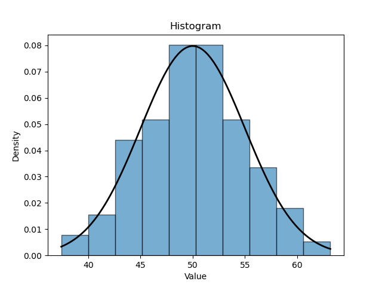
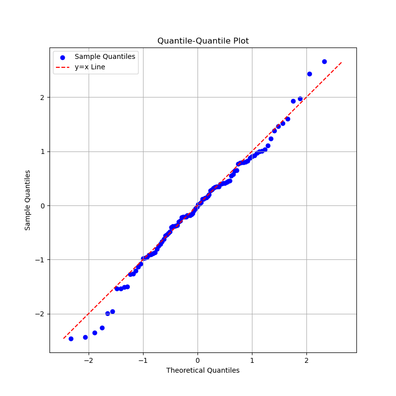

# `sdatools.data_visualisation`

This module provides a suite of statistical visualisations for analysing your data.

Currently supported visualisations are:

- Histograms
- Q-Q plots

## Examples

### Create a histogram from Normally distributed sample data

```python
from sdatools.data_visualisation.histogram import Histogram
import numpy as np
import scipy.stats as stats

# Generate random data from a normal distribution
mean = 50
std_dev = 5
size = 150
data = np.random.normal(loc=mean, scale=std_dev, size=size).tolist()

# Plot histogram
histogram = Histogram(data)
histogram.plot()

# Overlay Normal PDF
x_values = np.linspace(min(data), max(data), 100)
pdf = stats.norm.pdf(x_values, mean, std_dev)
histogram.overlay_pdf(x_values, pdf)

histogram.save_fig("output/file/path/here.png")
```

The following output figure is produced:

<picture align="center">
  <source media="(prefers-color-scheme: dark)" srcset="images/fig1.png">
  
</picture>

### Create a Q-Q plot from Normally distributed sample data

```python
from sdatools.distributions.continuous.normal import NormalDistribution
from sdatools.data_visualisation.qq_plot import QQPlot
import numpy as np

# Create a normal distribution
normal_dist = NormalDistribution(0, 1)

# Generate sample quantiles from the normal distribution
sample_quantiles: list[float] = normal_dist.sample(100)
sample_quantiles.sort()

# Generate theoretical quantiles for the normal distribution
probs = np.linspace(0.01, 0.99, 100)
theoretical_quantiles: list[float] = [normal_dist.inverse_cdf(p) for p in probs]
theoretical_quantiles.sort()

# Create a QQPlot instance
qq_plot = QQPlot(theoretical_distribution=normal_dist)

# Plot the QQ plot
qq_plot.plot(theoretical_quantiles, sample_quantiles, show_plot=True)
```

The following output figure is produced:

<picture align="center">
  <source media="(prefers-color-scheme: dark)" srcset="images/fig2.png">
  
</picture>