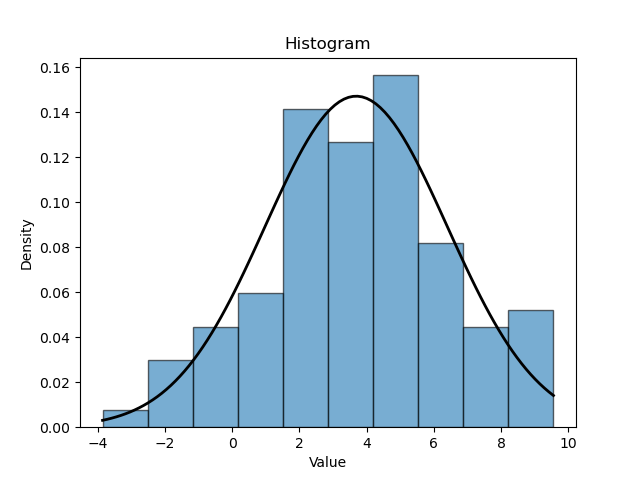

# `sdatools.distributions`

This module provides reusable probability distributions for analytical and sampling purposes.

Continuous distributions currently supported are:

- Exponential - $\text{Exp}(\lambda)$
- Gamma - $\text{Gamma}(\alpha, \beta)$
- Johnson's $S_U$ - $\text{JSU}(\gamma, \delta, \xi, \lambda)$
- Lognormal - $\text{Lognormal}(\mu, \sigma^2)$
- Uniform - $U[a, b]$
- Normal - $N(\mu,\sigma^2)$
- Skew-normal - $\text{SN}(\xi, \omega, \alpha)$

Discrete distributions currently supported are:

- Binomial - $\text{Bin}(n, p)$
- Poisson - $\text{Po}(\lambda)$

## Structure

All distributions inherit from either a `DiscreteDistribution` or `ContinuousDistribution` abstract class. These abstract classes themselves inherit from the abstract base class `Distribution`, located in `abstract/distribution.py`. The abstract base class enforces the following properties for each `Distribution` subclass:

- The domain of the distribution: `domain` (in `list[int]` or `list[float]` format, e.g. `[0, 100]`)
- Moments of the distribution: `mean`, `variance`, `skewness`, and `kurtosis` (in `float` format)

Standard deviation is calculated automatically using the variance, and is accessed via the `stddev()` method.

`DiscreteDistribution` and `ContinuousDistribution` enforce further implementations specific to each distribution type, such as:

- `pdf(x)` / `pmf(x)`,
- `cdf(x)`.

Distributions where the inverse CDF, `inverse_cdf()`, has been implemented automatically implement a sampling method, `sample()`, using the inverse CDF.

## Examples

### Sampling from the Normal Distribution

```python
from sdatools.distributions.continuous.normal import NormalDistribution

dist = NormalDistribution(mu=0, sigma=1)
samples = dist.sample(1000) 
```

### Fitting a Normal Distribution using the Method of Moments

```python
from sdatools.distributions.continuous.normal import NormalDistribution
from sdatools.parameter_estimation.method_of_moments import MethodOfMoments
from sdatools.data_visualisation.histogram import Histogram

# Example data sampled from Normal distribution of mean 4, stddev 3
data: list[float] = [5.49, 3.59, 5.94, 8.57, 3.3, 3.3, 8.74, 6.3, 2.59, 5.63, 2.61, 2.6, 4.73, -1.74, -1.17, 2.31, 0.96, 4.94, 1.28, -0.24, 8.4, 3.32, 4.2, -0.27, 2.37, 4.33, 0.55, 5.13, 2.2, 3.12, 2.19, 9.56, 3.96, 0.83, 6.47, 0.34, 4.63, -1.88, 0.02, 4.59, 6.22, 4.51, 3.65, 3.1, -0.44, 1.84, 2.62, 7.17, 5.03, -1.29, 4.97, 2.84, 1.97, 5.84, 7.09, 6.79, 1.48, 3.07, 4.99, 6.93, 2.56, 3.44, 0.68, 0.41, 6.44, 8.07, 3.78, 7.01, 5.08, 2.06, 5.08, 8.61, 3.89, 8.69, -3.86, 6.47, 4.26, 3.1, 4.28, -1.96, 3.34, 5.07, 8.43, 2.45, 1.57, 2.49, 6.75, 4.99, 2.41, 5.54, 4.29, 6.91, 1.89, 3.02, 2.82, -0.39, 4.89, 4.78, 4.02, 3.3]
 
# Fit a NormalDistribution
mom = MethodOfMoments(data)
fitted_normal: NormalDistribution = mom.fit(NormalDistribution())

# Check parameters
print(f"Fitted distribution mean: {fitted_dist.mu}") # 3.6883000000000004
print(f"Fitted distribution stddev: {fitted_dist.sigma}") # 2.71092716796302

# Plot histogram
histogram = Histogram(data)
histogram.plot()

# Overlay Normal PDF
histogram.overlay_pdf(dist=fitted_normal)

histogram.save_fig("output/file/path/here.png")
```

The following output figure is produced:

<picture align="center">
  <source media="(prefers-color-scheme: dark)" srcset="images/fig1.png">
  
</picture>