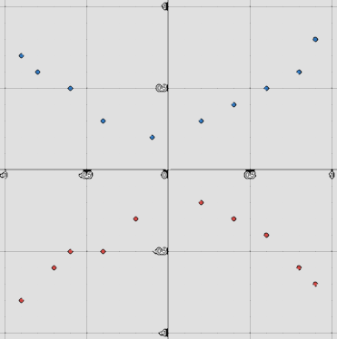
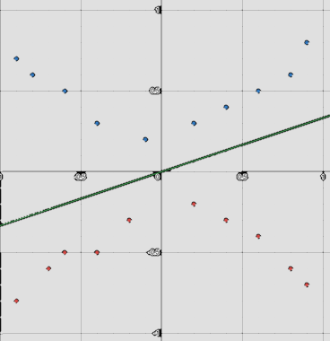

# Support Vector Machines (SVMs)

**Last Updated:** 2nd August 2025

## Introduction: Linear SVMs

Consider a binary classification problem: that is, where $N$ samples $\{(\underline{x}^{(i)},y^{(i)})\}_{i=1}^N$ of **observations** $\underline{x}^{(i)}\in \mathbb{R}^n$ and **targets** $y^{(i)} \in \{\text{Yes}, \text{No}\}$ are provided, and a classifier function $f$ is sought such that future observations $\underline{x}'$ outside the sample dataset can be appropriately classified (as $\text{Yes}$ or $\text{No}$) via $f(\underline{x}')$.

To illustrate the problem set-up, let's consider a 2D version. In the below, the blue samples represent $\text{Yes}$ obrservations, and red samples represent $\text{No}$ observations:

  

The observations are clearly separable by a straight line. The problem can be re-written as finding the parameters $w, b \in \mathbb{R}$ such that the line $y=wx+b$ "best" separates the two groups of observations. In higher dimensions, this generalises to finding the hyperplane 

$$H=\{\underline{x}\in\mathbb{R}^n : \underline{w}^T\underline{x}+\underline{b}=0\}.$$

How do we find the "best" line? There seem to be a lot of decent choices. For example, the line $y=\frac{1}{3}x$ separates the classes of red and blue observations:

  

A neat trick that will help is the fact that, no matter what line we choose, if we re-write the targets as $y^{(i)}\in \{-1,1\}$, with $1$ representing the blue class and $-1$ representing the red class, then the function 
$$f(x)=\text{sgn}(wx+b)$$
correctly classifies the observations. The "best" classifier $y=wx+b$ would then be the line that gives rise to the maximum margin between the line and the observations, i.e. the geometric distance $d=\frac{|w\underline{x}^{(i)}+b|}{||w||}$.

More commentary to follow.